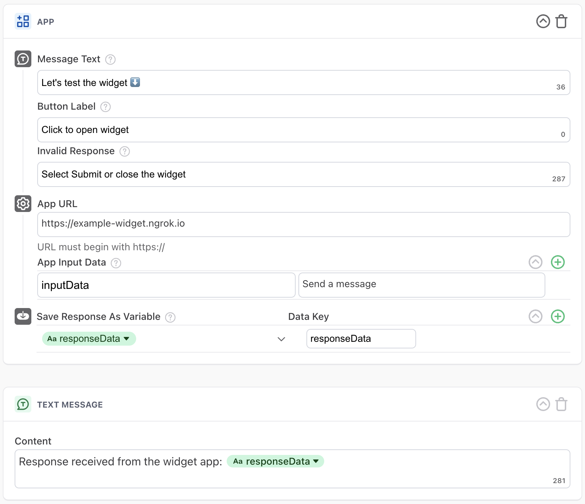

# template-widget

A Minimal Ada App

## Configuration
This is how the App is configured in the Ada bot dashboard:

## Full app user flow
This is what the user flow looks like for this example template widget:

## Active view
This is how the App looks when it is active:

## Submitted view
This is how the App looks when the user has successfully submitted data:

## Inactive view
This is how the App looks when the user reloads a chat with an already-completed widget:
